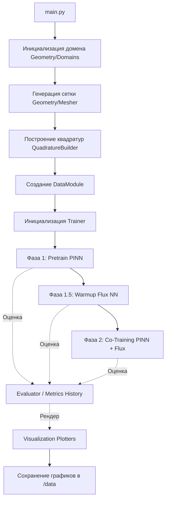
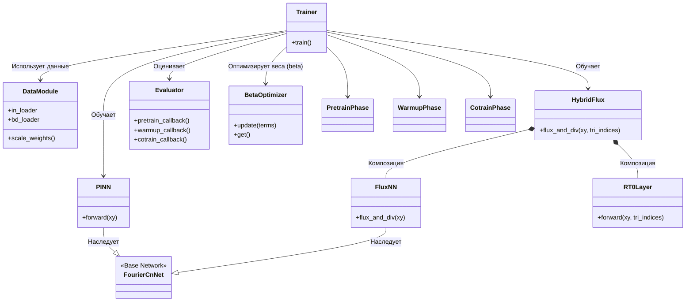

# Majorant PINN (Физически-информированные нейронные сети с мажорантными оценками)

Данный проект реализует решение краевых задач для уравнений в частных производных (УЧП) с использованием физически-информированных нейронных сетей (PINN). Основная особенность проекта — использование **функционалов мажорант** (Majorant Functionals) для надежной и точной апостериорной оценки ошибки, а также совместное обучение (co-training) сети решения (PINN) и сети потока (Flux NN) с использованием элементов Равиара-Тома (RT0).

---

## 📁 Структура проекта (Project Structure)

```text
majorant_pinn/
├── main.py                  # Главный скрипт для запуска обучения
├── config.py                # Конфигурационные параметры (архитектуры, обучение, гиперпараметры)
├── run_tests.py             # Скрипт для запуска модульных тестов
├── data_const/              # Директория с предвычисленными константами доменов (.json)
├── evaluation/              # Оценка метрик, вычисление ошибок и логирование истории
│   ├── evaluator.py
│   └── metrics_history.py
├── fem/                     # Метод конечных элементов (поддержка RT0)
│   ├── rt0.py
│   └── topology.py
├── file_io/                 # Чтение/запись данных и логирование
│   ├── constants_loader.py
│   └── logger.py
├── functionals/             # Математические операторы, потери, интегралы и мажоранты
│   ├── errors.py
│   ├── integrals.py
│   ├── losses.py
│   ├── majorant.py
│   └── operators.py
├── geometry/                # Генерация доменов, сеток и квадратур
│   ├── domains.py
│   ├── mesher.py
│   └── quadrature.py
├── networks/                # Архитектуры нейронных сетей (PINN, FluxNN, C^n активации)
│   ├── activations.py
│   ├── blocks.py
│   ├── corners.py
│   ├── flux_nn.py
│   ├── hybrid_flux.py
│   └── pinn.py
├── problems/                # Аналитические решения для тестирования и оценки
│   └── solutions.py
├── tests/                   # Модульные тесты для всех компонентов
├── training/                # Логика обучения (фазы, загрузчики данных, оптимизаторы)
│   ├── beta_optimizer.py
│   ├── cotrain_phase.py
│   ├── data_module.py
│   ├── pretrain_phase.py
│   ├── trainer.py
│   └── warmup_phase.py
└── visualization/           # Построение графиков метрик и полей
    ├── field_evaluator.py
    ├── field_plotter.py
    └── metrics_plotter.py
```

---

## 🏗 График структуры проекта (Project Workflow)

Данная диаграмма показывает последовательность выполнения программы при запуске `main.py`.



---

## 🧩 Структура классов (Class Diagram)

Диаграмма, иллюстрирующая связи между основными классами проекта (архитектура, обучение, геометрия).



---

## 📝 Описание всех классов

### 1. Нейронные сети и архитектуры (`networks/`)
* **`CnActivation`**: Кастомная функция активации класса гладкости $C^n$, позволяющая настраивать уровень сглаживания и полиномиальное расширение.
* **`CnResBlock`**: Остаточный блок (Residual Block), использующий полносвязные слои со спектральной нормализацией и `CnActivation`.
* **`ScaleBranch`**: Масштабная ветвь, применяющая фурье-признаки в определенном диапазоне частот для захвата особенностей решения на разных масштабах.
* **`FourierCnNet`**: Базовый класс полносвязной нейросети с признаками Фурье (Random Fourier Features) и мультимасштабной архитектурой.
* **`PINN`**: Нейронная сеть для аппроксимации решения УЧП. Наследует `FourierCnNet`.
* **`FluxNN`**: Нейронная сеть для аппроксимации векторного поля потока. Наследует `FourierCnNet`.
* **`HybridFlux`**: Гибридная модель потока, объединяющая предсказания непрерывной нейросети (`FluxNN`) и дискретного базиса конечных элементов (`RT0Layer`).
* **`CornerEnrichment`**: Модуль "обогащения" признаков (enrichment) для лучшей аппроксимации сингулярностей решения в углах геометрии (особенно "входящих" углах).

### 2. Геометрия, Сетки и Квадратуры (`geometry/`)
* **`BaseDomain`**: Абстрактный базовый класс для всех геометрических областей (доменов). Определяет границы, типы граничных условий и отверстия.
* **Конкретные домены**: `SquareDomain`, `CircleDomain`, `LShapeDomain`, `HollowSquareDomain`, `PShapeDomain` (а также их `*Mixed` версии для смешанных граничных условий).
* **`Mesher`**: Генератор неструктурированных треугольных сеток с использованием триангуляции Делоне и релаксации Ллойда.
* **`QuadratureBuilder`**: Класс для построения квадратур Гаусса для численного интегрирования по объему (внутренности) и поверхности (границам).
* **`QuadratureData`** (dataclass): Контейнер для хранения всех точек квадратуры, весов, нормалей и масок граничных условий.

### 3. Обучение и Данные (`training/`)
* **`Trainer`**: Оркестратор процесса обучения. Управляет сетями, данными и последовательно запускает три фазы: Pretrain, Warmup и Cotrain.
* **`PretrainPhase`**: Первая фаза обучения — предварительное обучение PINN на классический лосс функции (уравнение + граница).
* **`WarmupPhase`**: Вторая фаза (1.5) — "прогрев" сети потока (`HybridFlux`) при замороженной PINN сети с использованием мажорантного функционала.
* **`CotrainPhase`**: Третья фаза — совместное альтернирующее обучение PINN и сети потока на мажорантный лосс.
* **`DataModule`**: Класс-обертка над PyTorch `DataLoader`, подготавливающий и выдающий батчи квадратурных точек для объема и границ.
* **`TrainingSample`** (dataclass): Контейнер для хранения обучающей выборки (точки, точные решения, правая часть уравнения, граничные условия).
* **`BetaOptimizer`**: Оптимизатор весовых коэффициентов $\beta_1, \beta_2, \beta_3$ мажорантного функционала для получения наиболее точной (минимальной) оценки ошибки.

### 4. МКЭ и Топология (`fem/`)
* **`RT0Layer`**: Слой нейронной сети, реализующий базисные функции конечных элементов Равиара-Тома нулевого порядка (Raviart-Thomas $RT_0$) для аппроксимации потока.
* **`MeshTopology`** (dataclass): Хранит информацию о связности сетки (ребра, треугольники, знаки нормалей, площади).

### 5. Функционалы и Математика (`functionals/`)
* **`DomainConstants`** (dataclass): Хранит предвычисленные константы Фридрихса ($C_F$), следа ($C_{trN}$) и продолжения ($C_{ext}$) для конкретной геометрии.
* **`MajorantTerms`** (dataclass): Контейнер для хранения 4-х слагаемых мажоранты ($A_1, A_2, A_3, A_4$).
* *(Вспомогательные функции)*: `compute_majorant`, `domain_integral`, `boundary_integral`, `gradient`, `laplacian`, `bc_losses`.

### 6. Оценка и Визуализация (`evaluation/` & `visualization/`)
* **`Evaluator`**: Класс, отвечающий за расчет всех метрик (L2 ошибка, энергетическая ошибка, значение мажоранты, индекс эффективности $I_{eff}$) во время всех фаз обучения.
* **`MetricsHistory`** и **`PhaseMetrics`**: Классы для отслеживания, хранения и агрегации истории метрик по эпохам.
* **`FieldValues`** (dataclass): Контейнер с рассчитанными значениями полей (ошибка, плотность мажоранты) для отрисовки.
* *(Функции визуализации)*: `plot_fields_phase1`, `plot_fields_phase2`, `plot_cotrain_metrics`, `plot_mesh` и другие (используют `matplotlib`).

### 7. Задачи и Решения (`problems/`)
* **`AnalyticalSolution`**: Абстрактный класс для аналитических решений (для валидации метода).
* **Реализации**: `SineSolution` ($u = \sin(\pi x)\sin(\pi y)$), `ExponentialSolution`, `PolynomialSolution`.

### 8. Ввод/Вывод (`file_io/`)
* **`FileLogger`**: Класс для записи логов обучения в текстовый файл и вывода в консоль с отметками времени.
